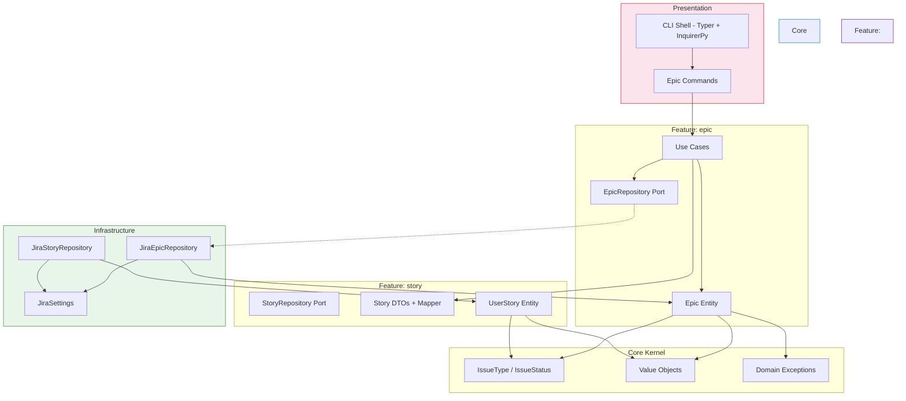
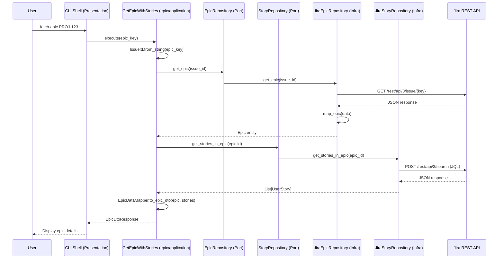

# Architecture Overview

DevWorkWire follows **Clean Architecture** principles combined with **Domain-Driven Design** (DDD) patterns, organized as **vertical feature slices**. The goal is to keep domain logic independent of external concerns (Jira API, CLI framework, logging), making the system testable, maintainable, and adaptable to change.

## Feature Slices

Instead of one global layer stack, each business capability owns its full vertical slice under `src/devworkwire/features/`, collaborating through a single unified provider port:

```
src/devworkwire/
├── application/                 # Cross-feature ports (WorkItemProvider)
├── config/                      # AppConfig singleton, ProjectConfig loader, environment YAML files
├── core/domain/                 # Shared kernel (issue types/statuses, value objects, exceptions)
├── features/
│   ├── epic/                    # Epic slice
│   │   ├── application/         # Use cases, DTOs, mappers, markdown parsing
│   │   └── domain/              # Epic entity
│   └── story/                   # Story slice
│       ├── application/         # DTOs, mappers
│       └── domain/              # UserStory entity
├── infrastructure/
│   └── external/jira/           # Jira adapter (WorkItemProvider impl), settings, parsing
├── presentation/                # CLI shell (Typer commands + interactive menu)
└── shared/                      # Cross-cutting utilities (logging, retry)
```

**Dependency rules:**

1. Features depend on `core` and `shared` — never the other way around.
2. Features never import each other's internals; cross-feature collaboration uses the shared `WorkItemProvider` port or public DTOs/mappers.
3. Dependencies point inward inside each slice: `domain` knows nothing about `application`, which knows nothing about `infrastructure`.



## Request Flow



## Core Kernel (`src/devworkwire/core/domain/`)

Concepts shared by every feature. Completely framework-agnostic.

#### Issue Abstractions (`issue.py`)

`IssueType` and `IssueStatus` describe what an issue *is* and where it *stands* — shared by epics and stories alike.

#### Value Objects (`value_objects/`)

Immutable, self-validating objects with no identity. Equality is based on value, not reference.

| Value Object | Description | Key Behavior |
|-------------|-------------|--------------|
| `IssueId` | Jira issue key + numeric ID | Parsed from strings like `PROJ-123` |
| `Priority` | Priority level (Highest → Lowest) | Comparison: `priority.is_higher_than(other)` |
| `StoryPoints` | Estimation points | Arithmetic: `sp1 + sp2`, `sp * 3` |
| `Label` | Case-insensitive tag | Max 255 chars, non-empty validation |
| `LabelSet` | Immutable collection of labels | Set operations: `add()`, `remove()`, `contains()` |

All value objects use `@dataclass(frozen=True)` for immutability.

#### Domain Exceptions (`exceptions/`)

Structured error hierarchy rooted at `DomainException`:

```
DomainException
├── EntityNotFoundException      # Epic/story not found
├── BusinessRuleViolationException  # Invalid data or state
├── DuplicateEntityException     # Duplicate issue detected
├── InvalidStatusTransitionException  # Illegal status change
└── UnauthorizedWorkspaceAccess  # Cross-project access attempt
```

## Epic Feature (`src/devworkwire/features/epic/`)

Everything the epic capability needs, in one place.

### Domain (`domain/epic.py`)

**`Epic`** — A large body of work that can contain multiple stories. Uses the **Factory Method** pattern — direct `__init__` is blocked; use `.create()`:

```python
epic = Epic.create(
    key="PROJ-123",
    numeric_id=10042,
    summary="User Authentication System",
    description="Implement OAuth2-based authentication...",
    status=IssueStatus.TODO,
    created_at=datetime.now(),
    updated_at=datetime.now(),
    priority="High",
    labels=["auth", "security"],
    story_points=21,
)
```

Invariants are enforced at construction time: keys can't be empty, numeric IDs must be non-negative, summaries are required.

### Application (`application/`)

Orchestrates domain objects to fulfill use cases. Depends only on abstractions.

#### Use Cases

Each use case is a single-responsibility class receiving its dependencies via constructor injection:

```python
class GetEpicWithStories:
    def __init__(self, epic_repository: EpicRepository, story_repository: StoryRepository):
        self.epic_repository = epic_repository
        self.story_repository = story_repository

    async def execute(self, epic_key: str) -> EpicDtoResponse:
        epic_id = IssueId.from_string(epic_key)
        epic = await self.epic_repository.get_epic(epic_id)
        if not epic:
            raise EntityNotFoundException("Epic", epic_key)
        stories = await self.story_repository.get_stories_in_epic(epic.id)
        return EpicDataMapper.to_epic_dto(epic, stories)
```

Note how the epic use case consumes the **story port** — cross-feature collaboration happens through interfaces, never through imports of story internals beyond its public API (`ports.py`, `dtos.py`, `mappers.py`).

## Provider Port (`application/ports.py`)

A single `WorkItemProvider` ABC defines the boundary between DevWorkWire and any project tracker. Both the CLI and (later) the MCP server call this port; adapters behind it (Jira today, Linear/Azure DevOps later) are swappable without touching the core.

```python
class WorkItemProvider(ABC):
    async def get_epic(self, issue_id: IssueId) -> Optional[Epic]: ...
    async def create_epic(self, summary: str, description: str) -> Epic: ...
    async def find_epics_by_project(self, project_key: str) -> List[Epic]: ...
    async def get_stories_in_epic(self, epic_id: IssueId) -> List[UserStory]: ...
```

This is the "Provider Port" in the plan's hexagonal diagram. Only one adapter implements it today (`JiraWorkItemProvider`); the core service, CLI, and MCP tool definitions depend solely on the port.

#### DTOs and Mappers

DTOs define the data shape at boundaries; mappers transform between them:

```
Epic entity → EpicDataMapper.to_epic_dto() → EpicDtoResponse
```

`EpicDtoResponse` embeds `StoryDtoResponse` items owned by the story feature.

#### Markdown Parsing (`markdown_parser.py`)

`EpicMarkdownParser` extracts epic title/key/description from Markdown source files — an application concern feeding `CreateEpicFromMarkdown`.

### Infrastructure (`infrastructure/external/jira/work_item_provider.py`)

Concrete implementation of `WorkItemProvider` using `httpx` for async HTTP calls:

```python
class JiraWorkItemProvider(WorkItemProvider):
    def __init__(self, settings: JiraSettings, project_config: ProjectConfig):
        self.settings = settings
        self.project_config = project_config

    async def get_epic(self, issue_id: IssueId) -> Optional[Epic]:
        url = f"{self.settings.base_url}/rest/api/3/issue/{issue_id.key}"
        ...
        return map_epic(response.json(), self._story_points_field)
```

Module-level mapper functions (`map_epic`, `map_user_story`) convert raw JSON into domain entities via factory methods, using `project_config.field_mappings` for custom fields.

## Story Feature (`src/devworkwire/features/story/`)

Mirrors the epic layout at smaller scope:

- **Domain**: `UserStory` entity with `create(key=..., epic_key=...)` factory.
- **Application**: `StoryDtoResponse`/`CreateStoryDtoRequest` DTOs, `StoryDataMapper`.

The story feature has **no knowledge of the epic feature** — it exposes DTOs that the use cases consume. Both features' read/write operations flow through the single `WorkItemProvider` port.

## Shared Infrastructure Support (`src/devworkwire/infrastructure/external/jira/`)

Cross-feature plumbing used by the adapter:

- **`settings.py`** — `JiraSettings`: frozen dataclass holding `base_url`, `email`, `api_token`, `timeout`. Built via `from_dict()` (validates required keys, raising `BusinessRuleViolationException` when incomplete) or `from_config()` (reads the `jira` block from `AppConfig`). Project selection lives in `ProjectConfig`.
- **`work_item_provider.py`** — `JiraWorkItemProvider`: the single Jira adapter implementing `WorkItemProvider` for all work-item operations.
- **`parsing.py`** — `parse_jira_datetime()` converts Jira's timestamp format into timezone-aware datetimes.

## Configuration (`src/devworkwire/config/`)

Two config layers work together:

1. **`AppConfig`** singleton: loads `.env` variables via `python-dotenv`, reads `APP_ENV` to select a `config_{env}.yml` file (logging, Jira connection settings), provides `get_config("jira.timeout")` with dot-notation access.
2. **`ProjectConfig`**: loads `devworkwire.yml` from the working directory (overridable with `--config`), declaring the provider, project key, and field mappings. Validated at startup; raises `BusinessRuleViolationException` on missing/unsupported values.

## Presentation Layer (`src/devworkwire/presentation/cli.py`)

A thin **shell** built with **Typer** and **InquirerPy**. It wires registered commands to feature presentation handlers but contains no business logic:

```python
app = typer.Typer(no_args_is_help=False)

@app.command("fetch-epic")
def fetch_epic_command(issue_id: str):
    """Fetch an epic and its stories from Jira by key."""
    fetch_epic(issue_id)

@app.callback(invoke_without_command=True)
def main(ctx: typer.Context):
    if ctx.invoked_subcommand is None:
        show_welcome_message()
        interactive_menu()
```

Direct commands delegate to `src/devworkwire/features/epic/presentation/commands.py`, which receives the composition root (holding a `WorkItemProvider`). When invoked without a command, the interactive menu takes over.

## Shared Layer (`src/devworkwire/shared/`)

Cross-cutting utilities independent of business logic.

#### Logging (`logging.py`)

Centralized structured logging with request-correlation context. Emits single-line JSON by default (dev/prod) or human-readable plain text for local/container runs, selected via the `format_type` key in the environment YAML config (`text` or `json`). Correlation IDs (`request_id`, `user_id`) are injected into every record via context variables. Callers obtain a logger with `get_logger(__name__)`; `AppConfig` calls `initialize_logging()` at startup.

#### Utilities (`utils/`)

Reusable helpers: `retry_decorator` (exponential backoff for transient failures). Used by config loading and repository operations.

## Dependency Injection

Manual (no DI framework). A single composition root in `composition/container.py` wires the provider port:

```python
def build_composition(
    settings: JiraSettings, project_config: ProjectConfig
) -> Composition:
    if project_config.provider == "jira":
        provider = JiraWorkItemProvider(settings, project_config)
    return Composition(work_item_provider=provider)
```

Use cases receive the provider port through constructor injection; presentation handlers resolve it through the `Composition` dataclass.

## DDD Patterns in Use

| Pattern | Where | Why |
|---------|-------|-----|
| **Vertical Slice** | `features/epic/`, `features/story/` | Cohesion by capability; change one feature without touching the other |
| **Shared Kernel** | `core/domain/` | Single home for concepts every feature needs |
| **Factory Method** | `Epic.create()`, `UserStory.create()` | Ensures all invariants are checked before the object exists |
| **Value Object** | `IssueId`, `Priority`, `StoryPoints`, `Label` | Immutable, self-validating, equality by value |
| **Repository (Port)** | `WorkItemProvider` ABC | Decouple application layer from infrastructure; one port for all providers |
| **Entity** | `Epic`, `UserStory` | Objects with identity and lifecycle |
| **Domain Exception** | `EntityNotFoundException`, etc. | Business-meaningful errors, not generic exceptions |
| **DTO** | `EpicDtoResponse`, `StoryDtoResponse` | Clean boundary between layers |
| **Mapper** | `EpicDataMapper`, `StoryDataMapper` | Transform between layers without leaking concerns |
| **Composition Root** | `composition/container.py` | Single place wiring the provider port to the concrete adapter |

## Testing Architecture

Tests mirror the source structure — one test tree per slice:

```
tests/
├── unit/
│   ├── application/               # Port ABC tests
│   ├── config/                    # ProjectConfig loader tests
│   ├── core/
│   │   └── domain/              # Value objects, exceptions, issue abstractions
│   ├── features/
│   │   ├── epic/
│   │   │   ├── domain/          # Epic factory method tests
│   │   │   ├── application/     # Use case tests with mocked provider
│   │   │   └── presentation/    # Command handler tests
│   │   └── story/
│   │       ├── domain/          # UserStory factory method tests
│   │       └── application/     # Mapper tests
│   ├── infrastructure/          # Project-key restriction tests
│   ├── presentation/            # Typer command registration tests
│   └── shared/                  # Logging tests
└── integration/
    └── test_jira_work_item_provider.py  # Adapter with respx mocking
```

Use case tests mock the `WorkItemProvider` port. Adapter tests use `respx` to mock HTTP responses against the real adapter implementation.
